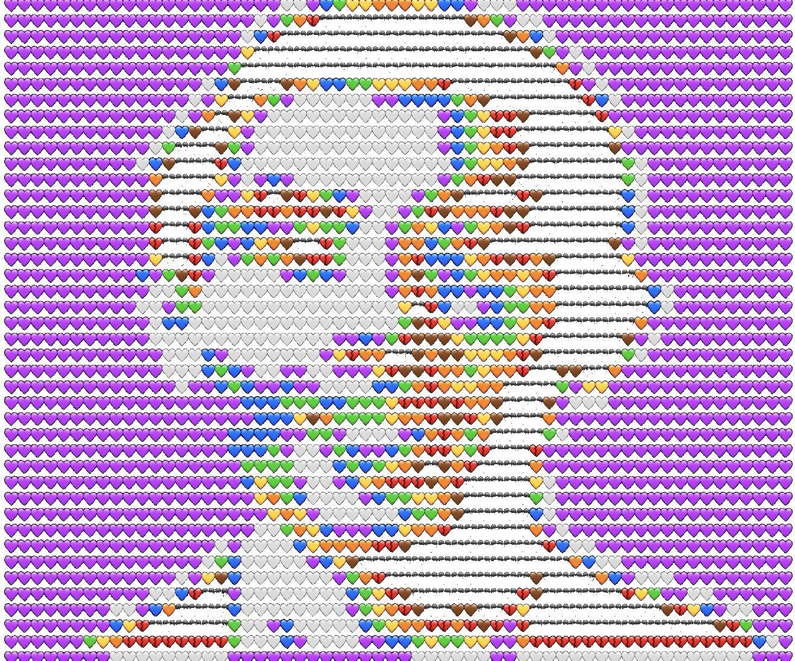

*Connect: [GitHub](https://github.com/qikevinl) | [Medium](https://medium.com/@qikevinl) | [Spotify](https://open.spotify.com/album/1s3McB6Rcd9LdZrKiNlH6N?si=UMRzS2qATF-e_6hkon5VgQ) | [Apple Music](https://music.apple.com/us/album/principals-of-ethics-single/1883981256) | [Vibe Check](https://soundcloud.com/keviano/kulhi-loach#t=0:08)*

# About — Kevin Qi

I'm **Kevin Qi**, a security engineer and aspiring neuroethics researcher.

I've been building on the web since I was 12. In the early 2000s, the internet was going through a pivotal transition — from chaotic, animated GeoCities-style pages to structured, semi-professional layouts for forums and portals. I co-founded a design studio called **AGFX** with a friend named Aaron who I met over the internet, and we were at the forefront of that shift. We were part of the first generation of digital natives who proved that high-level technical collaboration didn't require a physical office — we built AGFX through IRC, AIM, and the Envisionboard (InvisionFree) support forums we managed. I stopped supporting it after high school as life got busy.

That question about BCI safety didn't come from a textbook. A B12 deficiency damaged my nervous system. I couldn't walk for months. My hands were uncontrollable. I didn't feel like myself. Once you've felt your own nervous system fail you, the idea of plugging a machine into that system carries weight. It also gave me something I didn't expect: a personal understanding of how the brain adapts, breaks, and heals. That perspective is what drives this work. The people who build these technologies, and the patients who depend on them, deserve clear policy and ethical governance from the start.

## Why Neuroethics

The technical problems in BCI security are real, but the harder problems are human. Who decides what a neural device is allowed to do? What does informed consent look like when the technology interfaces with cognition itself? How do we ensure these devices serve patients equitably, not just the institutions that build them?

These are governance questions. Policy questions. Ethics questions. And they need people at the table who understand both the technology and its human implications.

My background is in cybersecurity. I understand layered defense, threat modeling, and vulnerability analysis. But what drew me to neuroethics is the recognition that the most important safeguards for brain-computer interfaces will not be technical. They will be the policies, consent frameworks, and ethical guidelines that determine how these technologies are developed, tested, and deployed. I want to help build those.

## What I Built

I catalogued every known BCI attack technique I could find: 60 at first, merged from three inventories. Then I asked: *what do computers and neurons actually have in common?* The answer was physics. Signals operating at different scales, from electromagnetic fields up through cortical oscillations. That became QIF's layered architecture.

When I mapped those techniques across the frequency bands, gaps appeared everywhere. The catalogue grew to 161. I traced each technique through neural pathways, cognitive functions, and psychiatric outcomes. CVSS wasn't built for this. It can't express whether damage is reversible or whether the patient can detect the violation. So I designed NISS for neural harm.

I was inspired by Francis Preston Venable's *The Development of the Periodic Law* (1896), found in a bookstore in Istanbul. It documented how the periodic table went through dozens of visual representations before arriving at the grid we know today. Mendeleev didn't just organize what was known. He left gaps for what wasn't. Those gaps predicted elements that were later discovered. QIF follows the same principle: organizing what we know, highlighting what we don't, evolving as discovery fills the gaps.

For more on the framework architecture and the therapeutic counterpart insight, see [README.md](README.md#the-tara-insight).

## How AI Was Used

AI (predominantly Claude, alongside Gemini and ChatGPT) helped me lay out ideas, validate research, and tie together pieces I mapped out. The architecture, scoring, clinical mappings, and cross-domain connections are mine. AI helped get the work out of my head and into a form others can evaluate.

Full disclosure: [Transparency Statement](governance/TRANSPARENCY.md) | [AI Ethics Principles](governance/policy/AI-ETHICS-PROPOSAL.md) | [Derivation Log](qif-framework/QIF-DERIVATION-LOG.md) (113 entries)

## What Comes Next

What I want to focus on next is the policy layer: governance frameworks, consent models, regulatory alignment, and ethical guidelines that ensure BCI technologies are developed safely and equitably. That is why I'm pursuing a master's in Neuroethics and Bioethics. The technical work showed me where the risks are. Graduate study will help me understand how to build the protections.

The goal is not to provide final answers. It's to start the right questions, and to make this space accessible for researchers, clinicians, and policymakers who want to contribute without needing to be security specialists first.

## Collaborate

This is a conversation I cannot have alone. I'm looking for academics, researchers, neuroscientists, and policymakers to refine QIF and establish ethical guidelines for where technology should and shouldn't go. The gaps are the research agenda.

If you work with neural data, BCI design, neuroethics, health policy, or regulatory compliance, [please reach out](https://github.com/qinnovates/qinnovate/issues).

**From designing web 1.0 to securing web 5.0. Let's connect the net together.**

---

*Connect: [GitHub](https://github.com/qikevinl) | [Medium](https://medium.com/@qikevinl) | [Spotify](https://open.spotify.com/album/1s3McB6Rcd9LdZrKiNlH6N?si=UMRzS2qATF-e_6hkon5VgQ) | [Apple Music](https://music.apple.com/us/album/principals-of-ethics-single/1883981256) | [Vibe Check](https://soundcloud.com/keviano/kulhi-loach#t=0:08)*
